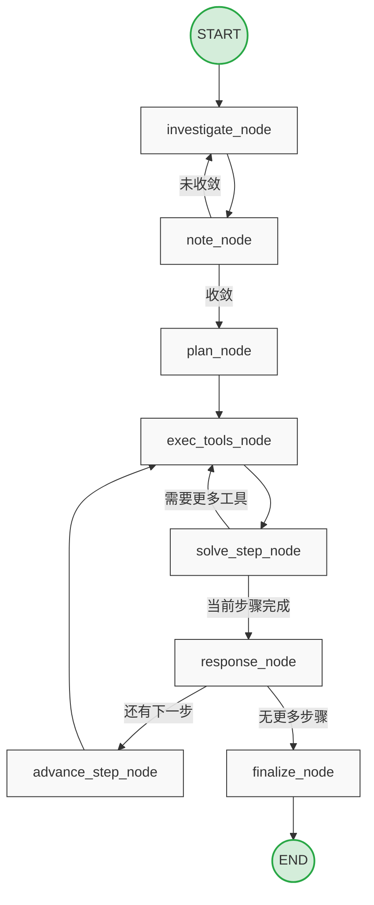
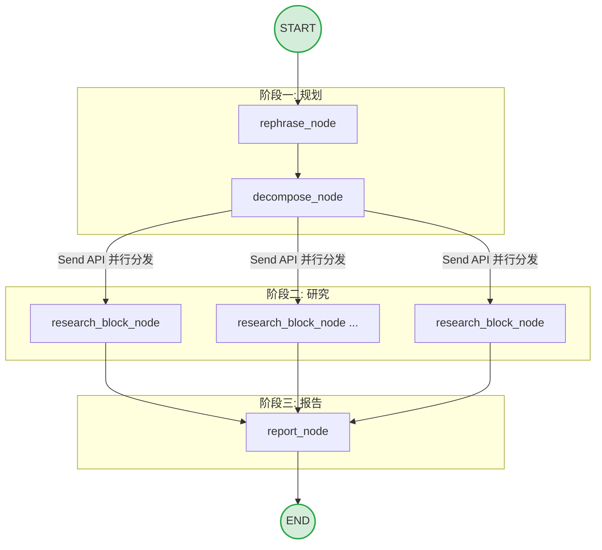
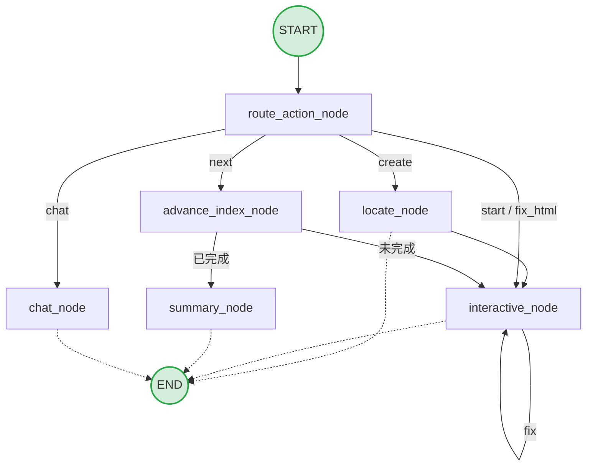
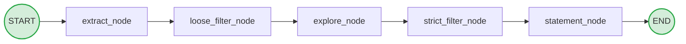
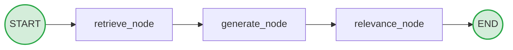
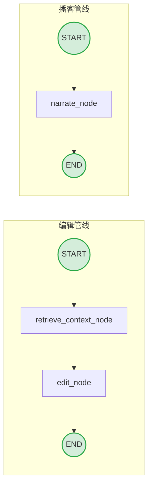
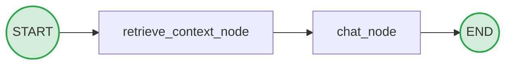

# 🚀 NeoTutor

基于 DeepTutor 理念重构的个人专属 AI 导师 Agent。本项目完全抛弃了原有的执行框架，底层采用 LangChain 与 LangGraph 进行彻底重写。通过构建基于图（Graph）的认知工作流与健壮的状态管理（State Management），实现了更具韧性的多智能体协同、反思纠错机制与 RAG 检索链路，专为打造高度定制化的 1v1 私人学习与效率助理。

**技术栈**：Python 3.10+ · FastAPI · LangChain · LangGraph · Next.js 16 · React 19 · TailwindCSS

------

## 🏗️ 核心架构

### 重构原则

所有智能体模块均已重构为纯 LangGraph 图结构，彻底移除原有 `BaseAgent` 继承体系，改为直接使用 LangChain 工厂函数。

**每个模块三件套：**

- `lg_graph.py` —— 定义节点拓扑与条件边（含 Send API 并行分发）
- `lg_nodes.py` —— 节点函数，内联所有 LLM 调用逻辑
- `lg_state.py` —— 基于 `TypedDict` 的强类型状态定义

**底层调用机制：**

- **LLM 调用**：`get_chat_model_from_env()` 工厂函数
- **Prompt 加载**：`get_prompt_manager().load_prompts(module, agent, language)`
- **状态传递**：LangGraph 原生 State + Checkpointer

------

## 🧩 七大功能模块

### 1. 🔍 Solve — 深度问题求解

用于解决需要多步骤推理的复杂问题，配合知识库检索与工具调用。

**双循环图结构：**

代码段



**节点说明：**

- **investigate_node**: 通过 RAG / 网络搜索 / 条目查询采集知识，构建知识链
- **note_node**: 对每条知识项 LLM 摘要提炼
- **plan_node**: 基于知识链规划求解步骤列表
- **exec_tools_node**: 执行当前步骤待处理的工具调用
- **solve_step_node**: 决策：发起新工具调用 或 标记步骤完成
- **response_node**: 汇总所有工具结果，生成步骤回答
- **advance_step_node**: 推进至下一步骤
- **finalize_node**: 编译最终答案（可选精确答案润色）

**特性：**

- **反思纠错**：调查环多轮迭代，知识未收敛则继续检索。
- **多工具支持**：RAG（naive/hybrid）、网络搜索、条目查询、代码执行。
- **完整引用链**：每步工具调用均生成引用（`rag_X`、`web_X`）。
- **前端实时流**：每节点推送 `{type:progress}` + `{type:log}` 两条事件。

------

### 2. 📝 Research — 深度研究报告

对给定主题进行多阶段系统性研究，产出带引用的 Markdown 研究报告。

**三阶段 Map-Reduce 图结构：**

代码段



**节点说明：**

- **rephrase_node**: 优化研究主题表述，提升检索质量
- **decompose_node**: 将主题拆解为若干子课题块（支持 RAG 辅助拆解）
- **research_block_node**: 对单个子课题多轮工具调用研究（可并行）
- **report_node**: 整合所有子课题结果，生成带引用的 Markdown 报告

**计划模式：**

| **模式**   | **子课题数** | **最大迭代** | **适用场景** |
| ---------- | ------------ | ------------ | ------------ |
| **quick**  | 2            | 2            | 快速了解     |
| **medium** | 3            | 4            | 一般研究     |
| **deep**   | 5            | 6            | 深度研究     |
| **auto**   | 自动         | 自动         | 自适应       |

**特性：**

- LangGraph `Send` API 实现子课题真正并行研究。
- 支持工具按需启用：RAG、网络搜索、学术论文检索、条目查询、代码执行。
- `CitationManager` 统一管理 `PLAN-XX` / `CIT-X-XX` 格式引用。
- 研究结果保存至 `data/user/research/{id}/report.md`。

------

### 3. 🎓 Guide — 引导式学习

基于笔记本记录，生成逐步交互式 HTML 学习页面，支持多轮对话。

**有状态图结构：**

代码段



**节点说明：**

- **locate_node**: 从笔记本记录中 LLM 提取知识点列表（含标题/摘要/难度）
- **interactive_node**: 为当前知识点生成交互式 HTML 学习页面
- **chat_node**: 围绕当前知识点进行多轮问答
- **advance_index_node**: 推进至下一个知识点
- **summary_node**: 所有知识点学习完成后生成学习总结报告
- **fix_html_node**: 用户反馈渲染问题时重新生成 HTML

**特性：**

- `MemorySaver` Checkpointer：跨连接保持会话状态。
- 知识点进度追踪与完成检测。
- HTML 渲染异常一键修复。

------

### 4. 💡 IdeaGen — 科研创意生成

从笔记本记录或自由文本描述中，系统性生成高质量科研创意。

**5 节点线性流水线：**

代码段



**节点说明：**

- **extract_node**: 从笔记本记录或输入文本提取知识点
- **loose_filter_node**: 宽松过滤，去除明显不适合的知识点
- **explore_node**: 每个知识点生成 5+ 个研究方向
- **strict_filter_node**: 严格过滤（每组至少保留 1 个，至少拒绝 2 个）
- **statement_node**: 为最终创意生成 Markdown 格式研究陈述

**特性：**

- 双重过滤机制保障创意质量。
- 支持笔记本跨记录整合输入。
- WebSocket 流式逐条推送创意：`{"type": "idea", "data": {...}}`。

------

### 5. 📝 Question — 智能题目生成

基于知识库内容，自动生成可配置的练习题目，支持仿真真实试卷风格。

**3 节点验证流水线：**

代码段



**节点说明：**

- **retrieve_node**: LLM 生成检索查询，并行拉取知识库上下文
- **generate_node**: 基于检索内容生成 N 道题目
- **relevance_node**: 分类验证题目与知识库的相关性，过滤低质量题目

**特性：**

- 可配置题目要求：难度、类型、主题、侧重点。
- 仿真模式：上传 PDF 试卷，仿照真实出题风格生成题目。
- 并行检索提升效率。

------

### 6. ✍️ Co-Writer — 智能写作助手

提供文本编辑、内容扩写/缩写/改写，以及一键生成播客语音稿。

**两套独立图：**

代码段



**节点说明：**

- **retrieve_context_node**: 按来源（RAG / 网络 / 无）获取参考上下文
- **edit_node**: 依据指令对文本执行改写 / 扩写 / 缩写
- **narrate_node**: 生成播客语音稿 + 提取要点 + 可选 TTS 音频

**特性：**

- 三种编辑动作：`rewrite` / `expand` / `shorten`。
- TTS 支持：OpenAI / Azure TTS，多种音色可选。
- 操作历史持久化，支持导出 Markdown。
- 自动标注（automark）功能。

------

### 7. 💬 Chat — 知识库对话

基于知识库的多轮对话助手，支持实时 RAG 检索与网络搜索增强回答。

**2 节点线性图：**

代码段



**节点说明：**

- **retrieve_context_node**: 按需检索知识库 / 网络，获取对话上下文
- **chat_node**: 结合上下文与历史消息生成回答

**特性：**

- `MemorySaver` 跨轮会话持久化。
- 回答附带 RAG 引用来源。
- 可独立开关 RAG 与网络搜索。

------

## 🛠️ 工具层

| **工具名称**      | **工具说明**                                             |
| ----------------- | -------------------------------------------------------- |
| **rag_tool**      | 向量库检索，支持 `naive` / `hybrid` 两种模式             |
| **web_search**    | 网络搜索，支持 Perplexity / Tavily / Serper / Jina / Exa |
| **paper_search**  | 学术论文检索（可设置年份范围）                           |
| **query_item**    | 知识库条目精准查询                                       |
| **code_executor** | Python 沙箱执行，含超时与工作区隔离                      |

------

## 🚀 快速开始

### 环境要求

- Python 3.10+
- Node.js 18+
- 至少一个 LLM API Key

### 1. 配置环境变量

Bash

```
cp .env.example .env
```

**.env 必填项：**

代码段

```
# LLM（必填）
LLM_BINDING=openai          # openai / anthropic / deepseek / ollama / ...
LLM_MODEL=gpt-4o
LLM_API_KEY=sk-...
LLM_HOST=                   # 本地模型或代理时填写

# Embedding（必填）
EMBEDDING_BINDING=openai
EMBEDDING_MODEL=text-embedding-3-large
EMBEDDING_API_KEY=sk-...
EMBEDDING_DIMENSION=3072    # 必须与模型输出维度一致

# 网络搜索（可选）
SEARCH_PROVIDER=tavily      # perplexity / tavily / serper / jina / exa
SEARCH_API_KEY=tvly-...

# TTS 语音（可选）
TTS_BINDING=openai
TTS_API_KEY=sk-...
TTS_VOICE=alloy

# 端口（默认值如下）
BACKEND_PORT=8001
FRONTEND_PORT=3782
```

### 2. 安装

Bash

```
# 一键安装（推荐）
python scripts/install_all.py

# 或手动安装
pip install -r requirements.txt
cd web && npm install
```

### 3. 启动

Bash

```
# 开发模式
python -m uvicorn src.api.main:app --host 0.0.0.0 --port 8001 --reload
cd web && npm run dev   # 新终端

# Docker
docker compose up -d
```

访问 `http://localhost:3782`

------

## 🌐 支持的提供商

| **类型**       | **提供商**                                                   |
| -------------- | ------------------------------------------------------------ |
| **LLM (云端)** | OpenAI · Azure OpenAI · Anthropic · DeepSeek · OpenRouter · Groq · Together · Mistral |
| **LLM (本地)** | Ollama · LM Studio · vLLM · Llama.cpp                        |
| **Embedding**  | OpenAI · Azure OpenAI · Jina · Cohere · HuggingFace · Google · Ollama · LM Studio |
| **网络搜索**   | Perplexity · Tavily · Serper · Jina · Exa                    |

------

## 📂 项目结构

Plaintext

```
NeoTutor/
├── src/
│   ├── agents/
│   │   ├── chat/
│   │   │   ├── lg_graph.py        # 2 节点线性图
│   │   │   ├── lg_nodes.py
│   │   │   └── lg_state.py
│   │   ├── co_writer/
│   │   │   ├── lg_graph.py        # 编辑 + 播客 两套图
│   │   │   ├── lg_nodes.py
│   │   │   └── lg_state.py
│   │   ├── guide/
│   │   │   ├── lg_graph.py        # 7 节点有状态图
│   │   │   ├── lg_nodes.py
│   │   │   └── lg_state.py
│   │   ├── ideagen/
│   │   │   ├── lg_graph.py        # 5 节点线性流水线
│   │   │   ├── lg_nodes.py
│   │   │   └── lg_state.py
│   │   ├── question/
│   │   │   ├── lg_graph.py        # 3 节点验证流水线
│   │   │   ├── lg_nodes.py
│   │   │   └── lg_state.py
│   │   ├── research/
│   │   │   ├── lg_graph.py        # 4 节点 Map-Reduce
│   │   │   ├── lg_nodes.py
│   │   │   └── lg_state.py
│   │   └── solve/
│   │       ├── lg_graph.py        # 8 节点双循环
│   │       ├── lg_nodes.py
│   │       └── lg_state.py
│   ├── api/
│   │   ├── main.py                # FastAPI 入口
│   │   ├── routers/               # HTTP / WebSocket 端点
│   │   └── utils/                 # notebook、history、progress
│   ├── services/
│   │   ├── llm/                   # LLM 提供商抽象 + langchain_factory
│   │   ├── embedding/
│   │   ├── rag/                   # Docling / MinerU 解析管线
│   │   ├── prompt/                # YAML Prompt 管理（en/zh）
│   │   └── search/
│   └── tools/                     # rag / web / paper / query / code
├── config/
│   ├── main.yaml                  # 全局路径、工具开关、模块参数
│   └── agents.yaml                # temperature / max_tokens per module
├── web/                           # Next.js App Router + i18n（en/zh）
├── data/
│   ├── knowledge_bases/           # 向量库（运行时生成）
│   └── user/                      # 用户输出
└── .env.example
```

------

## 🧑‍💻 开发指令

Bash

```
pytest tests/ -v             # 运行测试
ruff check . && ruff format . # 检查与格式化
mypy .                        # 类型检查
cd web && npm run build       # 前端构建
cd web && npm run i18n:check  # i18n 一致性检查
```

**配置说明：**

- `config/main.yaml`：工具开关、迭代次数、超时、并发度等运行参数。
- `config/agents.yaml`：各模块 LLM 参数（temperature、max_tokens）。

> **注**：API 启动时会自动校验两个配置文件中工具的一致性，不一致则拒绝启动。

------

## 💾 数据存储

| **数据类型**      | **路径**                                 |
| ----------------- | ---------------------------------------- |
| **Notebook 记录** | `data/user/notebook/`                    |
| **用户历史**      | `data/user/user_history.json`            |
| **Solve 会话**    | `data/user/solver_sessions.json`         |
| **Chat 会话**     | `data/user/chat_sessions.json`           |
| **研究报告**      | `data/user/research/{id}/report.md`      |
| **研究引用**      | `data/user/research/{id}/citations.json` |
| **语音文件**      | `data/user/co_writer/audio/`             |

------

## 📜 许可证

本项目基于 **AGPL-3.0** 协议开源
